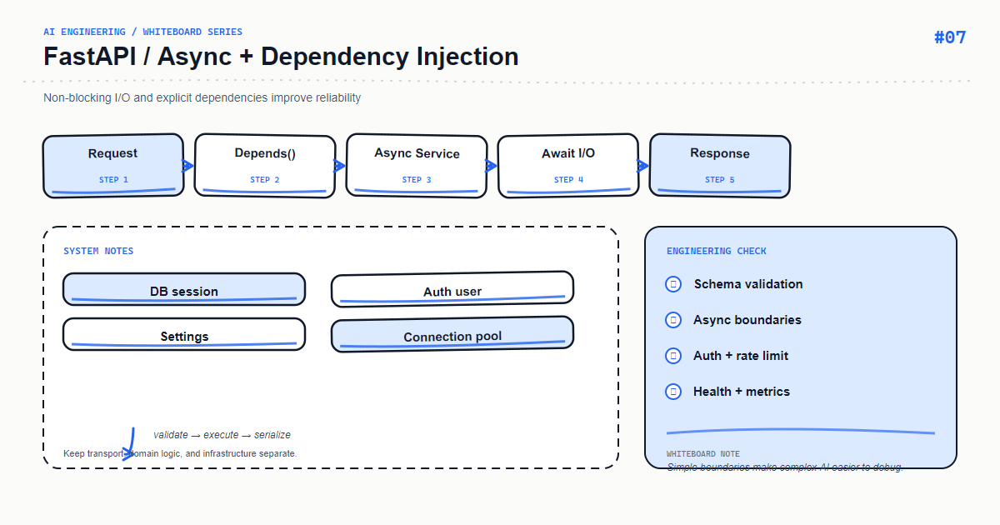

*Whiteboard: FastAPI — FastAPI Async and Dependency Injection.*

async def does not make blocking code faster. File I/O, synchronous SDKs, and CPU-heavy work can stall the event loop and slow every request.

## Core mental model

Async routes are appropriate for async network I/O. Isolate synchronous dependencies explicitly, and move CPU-heavy work to a queue or process pool. Dependency injection should make lifetimes visible and replacements easy.

## Key mechanics

Create shared clients in lifespan and reuse their connections. Use a semaphore to bound concurrent provider calls so your service does not overwhelm an upstream.

## Python example

```python
import asyncio
from contextlib import asynccontextmanager
from fastapi import FastAPI

limit = asyncio.Semaphore(20)

async def call_provider(client, payload):
    async with limit:
        return await client.post("/responses", json=payload, timeout=15)

@asynccontextmanager
async def lifespan(app: FastAPI):
    app.state.client = make_async_client()
    yield
    await app.state.client.aclose()

app = FastAPI(lifespan=lifespan)
```

## Course focus

This article turns the whiteboard into explicit engineering boundaries: define inputs and outputs first, then decide how state, failures, and observability work. The examples use Python and focus on durable design principles rather than a particular provider version; verify APIs against the documentation for your installed dependencies.

## Engineering practice

- Keep business rules in the application layer instead of hiding them in untestable prompts or route handlers.
- Add timeouts, bounded retries, and idempotency keys to external calls; retries are not a complete error strategy.
- Record a request id, latency, input version, model/index version, and outcome without logging sensitive raw content.
- Use a small fixed regression set first, then monitor quality and cost with sampled production traffic.

## Common mistakes

- Drawing only the happy path and omitting timeouts, empty results, rate limits, and rollback paths.
- Letting one function parse input, call providers, build prompts, and persist data.
- Replacing typed contracts with string conventions that can only be verified by manual integration.

## Production checklist

- [ ] Inputs, outputs, and error responses have explicit schemas
- [ ] External dependencies have timeouts, bounded retries, rate limits, and fallbacks
- [ ] Logs, metrics, and traces can be correlated to one request
- [ ] Critical paths have unit tests, integration tests, and offline evaluation samples
- [ ] Secrets, user content, and provider responses follow least-privilege and privacy rules

## Practice

Implement the smallest loop shown on the whiteboard. Inject a timeout, an empty result, and a malformed payload, then check whether the system remains stable and diagnosable. Add one metric that proves your optimization improved quality or latency.

## Hands-on exercise

Benchmark 50 concurrent requests with a synchronous fake client and an async fake client. Add a semaphore and compare upstream error rate and mean latency.

## Conclusion

An AI feature becomes maintainable when every arrow on the whiteboard maps to an input, an output, and a failure strategy.

