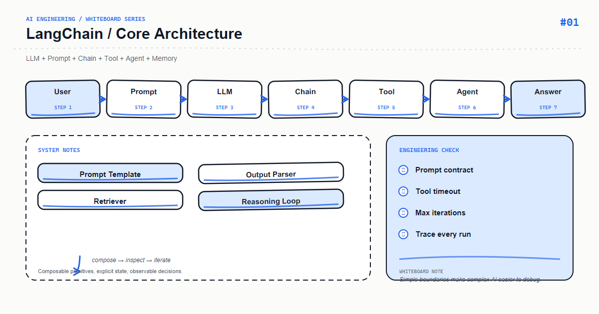

*Whiteboard: LangChain — LangChain Core Architecture.*

LangChain is more than a wrapper around a model. Its useful abstraction is a composable runtime: once a prompt, model, and parser are treated as Runnable stages, invocation, batching, streaming, and tracing follow the same shape.

## Core mental model

A typical path is input dict → ChatPromptTemplate → ChatModel → StrOutputParser. Each node owns a contract; the chain only composes them, making model swaps and isolated tests straightforward.

## Key mechanics

The | operator describes data flow. Use invoke for one request, batch for bulk work, and stream for low time-to-first-token. Production code should validate at boundaries and enforce timeouts instead of swallowing exceptions.

## Python example

```python
from langchain_core.output_parsers import StrOutputParser
from langchain_core.prompts import ChatPromptTemplate
from langchain_openai import ChatOpenAI

prompt = ChatPromptTemplate.from_messages([
    ("system", "You are a concise technical assistant."),
    ("human", "Explain in three points: {question}"),
])
model = ChatOpenAI(model="gpt-4o-mini", temperature=0)
chain = prompt | model | StrOutputParser()
answer = chain.invoke({"question": "What is idempotency?"})
```

## Course focus

This article turns the whiteboard into explicit engineering boundaries: define inputs and outputs first, then decide how state, failures, and observability work. The examples use Python and focus on durable design principles rather than a particular provider version; verify APIs against the documentation for your installed dependencies.

## Engineering practice

- Keep business rules in the application layer instead of hiding them in untestable prompts or route handlers.
- Add timeouts, bounded retries, and idempotency keys to external calls; retries are not a complete error strategy.
- Record a request id, latency, input version, model/index version, and outcome without logging sensitive raw content.
- Use a small fixed regression set first, then monitor quality and cost with sampled production traffic.

## Common mistakes

- Drawing only the happy path and omitting timeouts, empty results, rate limits, and rollback paths.
- Letting one function parse input, call providers, build prompts, and persist data.
- Replacing typed contracts with string conventions that can only be verified by manual integration.

## Production checklist

- [ ] Inputs, outputs, and error responses have explicit schemas
- [ ] External dependencies have timeouts, bounded retries, rate limits, and fallbacks
- [ ] Logs, metrics, and traces can be correlated to one request
- [ ] Critical paths have unit tests, integration tests, and offline evaluation samples
- [ ] Secrets, user content, and provider responses follow least-privilege and privacy rules

## Practice

Implement the smallest loop shown on the whiteboard. Inject a timeout, an empty result, and a malformed payload, then check whether the system remains stable and diagnosable. Add one metric that proves your optimization improved quality or latency.

## Hands-on exercise

Split the chain into replaceable render_prompt, call_model, and parse_output stages, and test the parser without a network call. When the model changes, tests should assert the final contract rather than provider-specific response fields.

## Conclusion

An AI feature becomes maintainable when every arrow on the whiteboard maps to an input, an output, and a failure strategy.

