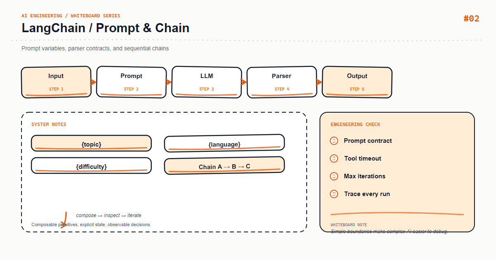

*Whiteboard: LangChain — LangChain Prompt Chains.*

A prompt is not an untracked block of text buried in code. It is a program component that needs versioning, input validation, and regression tests. This article builds a reliable template, structured input, model, and parser flow.

## Core mental model

A stable Prompt Chain separates system rules, the human task, and conversation context. Variable names should carry semantics; avoid letting a generic text value change meaning across stages.

## Key mechanics

Render and inspect the prompt before calling the model. Budget long context and delimit user text; never concatenate user-controlled content into system instructions.

## Python example

```python
from langchain_core.prompts import ChatPromptTemplate
from langchain_core.output_parsers import StrOutputParser

prompt = ChatPromptTemplate.from_messages([
    ("system", "Answer only from context; say when it is insufficient."),
    ("human", "<context>\n{context}\n</context>\nQuestion: {question}"),
])
chain = prompt | model | StrOutputParser()
print(chain.invoke({"context": "An idempotent request does not create extra side effects when repeated.", "question": "What problem does idempotency solve?"}))
```

## Course focus

This article turns the whiteboard into explicit engineering boundaries: define inputs and outputs first, then decide how state, failures, and observability work. The examples use Python and focus on durable design principles rather than a particular provider version; verify APIs against the documentation for your installed dependencies.

## Engineering practice

- Keep business rules in the application layer instead of hiding them in untestable prompts or route handlers.
- Add timeouts, bounded retries, and idempotency keys to external calls; retries are not a complete error strategy.
- Record a request id, latency, input version, model/index version, and outcome without logging sensitive raw content.
- Use a small fixed regression set first, then monitor quality and cost with sampled production traffic.

## Common mistakes

- Drawing only the happy path and omitting timeouts, empty results, rate limits, and rollback paths.
- Letting one function parse input, call providers, build prompts, and persist data.
- Replacing typed contracts with string conventions that can only be verified by manual integration.

## Production checklist

- [ ] Inputs, outputs, and error responses have explicit schemas
- [ ] External dependencies have timeouts, bounded retries, rate limits, and fallbacks
- [ ] Logs, metrics, and traces can be correlated to one request
- [ ] Critical paths have unit tests, integration tests, and offline evaluation samples
- [ ] Secrets, user content, and provider responses follow least-privilege and privacy rules

## Practice

Implement the smallest loop shown on the whiteboard. Inject a timeout, an empty result, and a malformed payload, then check whether the system remains stable and diagnosable. Add one metric that proves your optimization improved quality or latency.

## Hands-on exercise

Add a prompt_version, keep 20 fixed questions as a regression set, and compare factuality, abstention rate, and token usage before and after each prompt change.

## Conclusion

An AI feature becomes maintainable when every arrow on the whiteboard maps to an input, an output, and a failure strategy.

