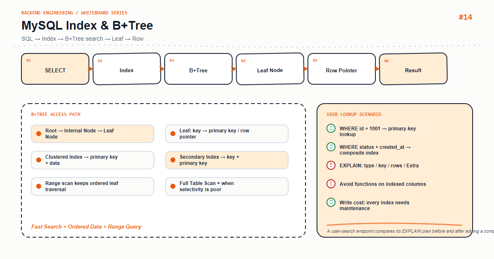

*Whiteboard note: the goal is not to memorize boxes, but to connect each arrow to a request, a contract, and an operational signal.*

## Start with a real scenario

Use this situation as the mental model: **A user-search endpoint compares its EXPLAIN plan before and after adding a composite index.**. A useful backend diagram answers four questions: where does input enter, who owns state, which boundary can fail, and how do we know the system is healthy? The flow is **SQL → Index → B+Tree search → Leaf → Row**.

## Deconstructing the architecture

- **Contract**: define input, output, and error shape before adding implementation detail.
- **Mechanism**: Root → Internal Node → Leaf Node; Leaf: key → primary key / row pointer. This is the part that determines latency, throughput, and testability.
- **State and resources**: Clustered Index → primary key + data; Secondary Index → key + primary key. Explain creation, ownership, cleanup, and recovery.
- **Failure path**: Range scan keeps ordered leaf traversal; combine it with **Full Table Scan × when selectivity is poor** when choosing a fallback, retry, or rollback.

## A small implementation boundary

The following sketch is intentionally small. It shows where a production implementation should place validation and ownership rather than pretending that a happy path is enough.

```text
request → bounded resource → validated boundary → observable result
```

Keep external systems behind an adapter, repository, client, or gateway. The domain layer should depend on a stable contract so tests can use fakes and incidents can be isolated to one boundary.

## Engineering decisions for the scenario

1. **Protect dependencies first.** Pools, queues, semaphores, caches, and worker counts need explicit limits. An unbounded queue only hides overload.
2. **Preserve correctness.** Use an idempotency key, transaction boundary, lock, version check, or schema validation where retries or concurrency can duplicate work.
3. **Optimize with evidence.** Use traces, slow-query data, GC pauses, queue depth, or p99 latency before choosing a cache, index, batch size, or concurrency setting.
4. **Make recovery testable.** Timeout, retry, rate limit, circuit breaking, rollback, and alerting should be exercised in a drill.

## Common mistakes

- Drawing only the happy path while omitting timeout, empty data, rejection, rollback, or replica lag.
- Treating framework defaults as business contracts and discovering their limits after an upgrade.
- Scaling machines before measuring pool exhaustion, lock contention, slow SQL, allocation, or event-loop blocking.
- Treating logs as the only observability tool; metrics, traces, sampling, and redaction are also required.

## Production checklist

- [ ] Input, output, and error responses have explicit schemas
- [ ] Dependencies have timeout, retry budgets, rate limits, and fallback behavior
- [ ] Pools and queues expose capacity, waiting, and rejected-work metrics
- [ ] Important state has idempotency, transaction, or recovery semantics
- [ ] Logs, metrics, and traces share a request or correlation ID
- [ ] Regression tests, load tests, and failure drills use production-like data

## Summary

You understand this whiteboard when you can start from one request, explain every arrow's contract, state how each risk is handled, and name the signal that would tell you to change the design.
