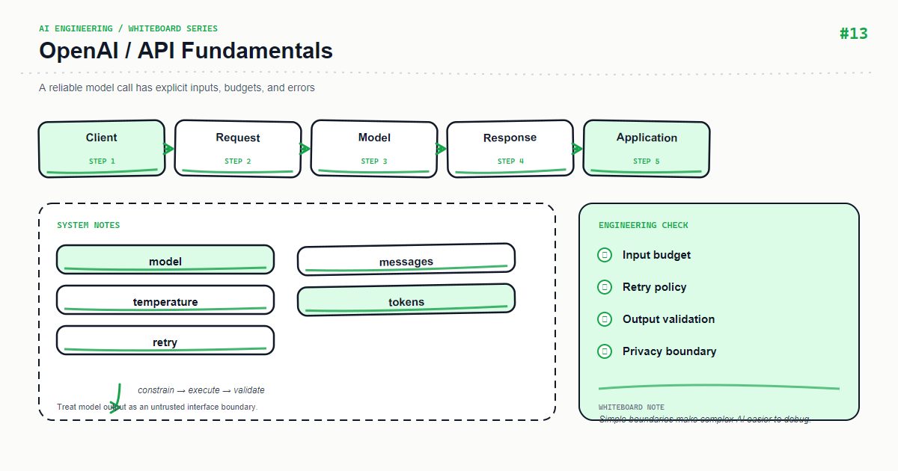

*Whiteboard: OpenAI — OpenAI API Fundamentals.*

The core of model API integration is not memorizing an endpoint. Treat the network call as an unreliable dependency and design request contracts, timeouts, error classes, and usage tracking from day one.

## Core mental model

A request contains system/developer rules, user input, and optional tools. The model output is a candidate result; the application must still validate, filter, and persist it.

## Key mechanics

Separate 4xx input/auth errors, 429 rate limits, 5xx upstream failures, and local timeouts. Retry only transient classes with jittered exponential backoff and a total budget.

## Python example

```python
import asyncio, random

async def call_with_retry(client, request, attempts=3):
    for n in range(attempts):
        try:
            return await client.responses.create(**request, timeout=20)
        except (TimeoutError, RateLimitError):
            if n == attempts - 1: raise
            await asyncio.sleep((2 ** n) + random.random())
```

## Course focus

This article turns the whiteboard into explicit engineering boundaries: define inputs and outputs first, then decide how state, failures, and observability work. The examples use Python and focus on durable design principles rather than a particular provider version; verify APIs against the documentation for your installed dependencies.

## Engineering practice

- Keep business rules in the application layer instead of hiding them in untestable prompts or route handlers.
- Add timeouts, bounded retries, and idempotency keys to external calls; retries are not a complete error strategy.
- Record a request id, latency, input version, model/index version, and outcome without logging sensitive raw content.
- Use a small fixed regression set first, then monitor quality and cost with sampled production traffic.

## Common mistakes

- Drawing only the happy path and omitting timeouts, empty results, rate limits, and rollback paths.
- Letting one function parse input, call providers, build prompts, and persist data.
- Replacing typed contracts with string conventions that can only be verified by manual integration.

## Production checklist

- [ ] Inputs, outputs, and error responses have explicit schemas
- [ ] External dependencies have timeouts, bounded retries, rate limits, and fallbacks
- [ ] Logs, metrics, and traces can be correlated to one request
- [ ] Critical paths have unit tests, integration tests, and offline evaluation samples
- [ ] Secrets, user content, and provider responses follow least-privilege and privacy rules

## Practice

Implement the smallest loop shown on the whiteboard. Inject a timeout, an empty result, and a malformed payload, then check whether the system remains stable and diagnosable. Add one metric that proves your optimization improved quality or latency.

## Hands-on exercise

Add request id, latency, input/output tokens, and error class logging. Use a fake client that emits 429 and 400 to verify only 429 is retried.

## Conclusion

An AI feature becomes maintainable when every arrow on the whiteboard maps to an input, an output, and a failure strategy.

