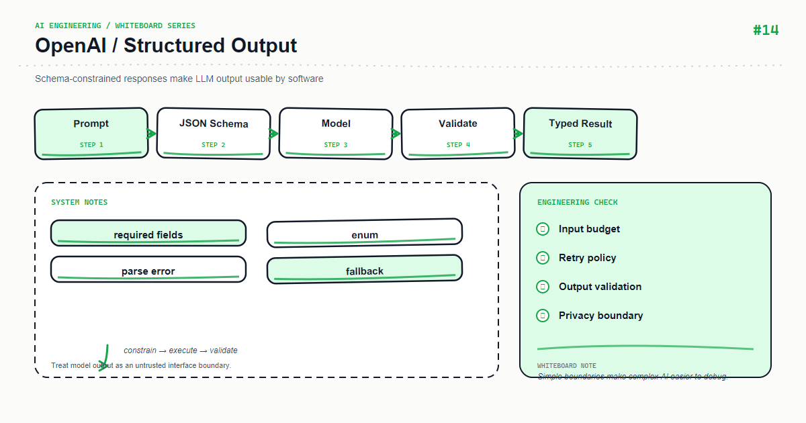

*Whiteboard: OpenAI — OpenAI Structured Outputs.*

Free text is useful for display; structured output is useful for programs. Structured Outputs do not make a model infallible—they make success, refusal, and failure distinguishable to code.

## Core mental model

A schema constrains types, required fields, and enums but cannot guarantee factual correctness. Business validation must still check ranges, permissions, and citation existence.

## Key mechanics

Separate transport, schema, and domain validation. When the model refuses or returns an incomplete result, do not silently fill defaults and disguise uncertainty as fact.

## Python example

```python
from pydantic import BaseModel, Field

class Incident(BaseModel):
    severity: str = Field(pattern="^(low|medium|high)$")
    summary: str = Field(min_length=1, max_length=500)
    actions: list[str] = Field(min_length=1, max_length=5)

response = client.responses.parse(model="gpt-4o-mini", input="Turn this incident log into a structured summary", text_format=Incident)
if response.output_parsed is None: raise ValueError("model_refusal_or_parse_failure")
```

## Course focus

This article turns the whiteboard into explicit engineering boundaries: define inputs and outputs first, then decide how state, failures, and observability work. The examples use Python and focus on durable design principles rather than a particular provider version; verify APIs against the documentation for your installed dependencies.

## Engineering practice

- Keep business rules in the application layer instead of hiding them in untestable prompts or route handlers.
- Add timeouts, bounded retries, and idempotency keys to external calls; retries are not a complete error strategy.
- Record a request id, latency, input version, model/index version, and outcome without logging sensitive raw content.
- Use a small fixed regression set first, then monitor quality and cost with sampled production traffic.

## Common mistakes

- Drawing only the happy path and omitting timeouts, empty results, rate limits, and rollback paths.
- Letting one function parse input, call providers, build prompts, and persist data.
- Replacing typed contracts with string conventions that can only be verified by manual integration.

## Production checklist

- [ ] Inputs, outputs, and error responses have explicit schemas
- [ ] External dependencies have timeouts, bounded retries, rate limits, and fallbacks
- [ ] Logs, metrics, and traces can be correlated to one request
- [ ] Critical paths have unit tests, integration tests, and offline evaluation samples
- [ ] Secrets, user content, and provider responses follow least-privilege and privacy rules

## Practice

Implement the smallest loop shown on the whiteboard. Inject a timeout, an empty result, and a malformed payload, then check whether the system remains stable and diagnosable. Add one metric that proves your optimization improved quality or latency.

## Hands-on exercise

Add a schema version and backward-compatible fields. Prepare normal, refusal, missing-field, and out-of-range fixtures and verify the API never returns half-valid JSON as success.

## Conclusion

An AI feature becomes maintainable when every arrow on the whiteboard maps to an input, an output, and a failure strategy.

