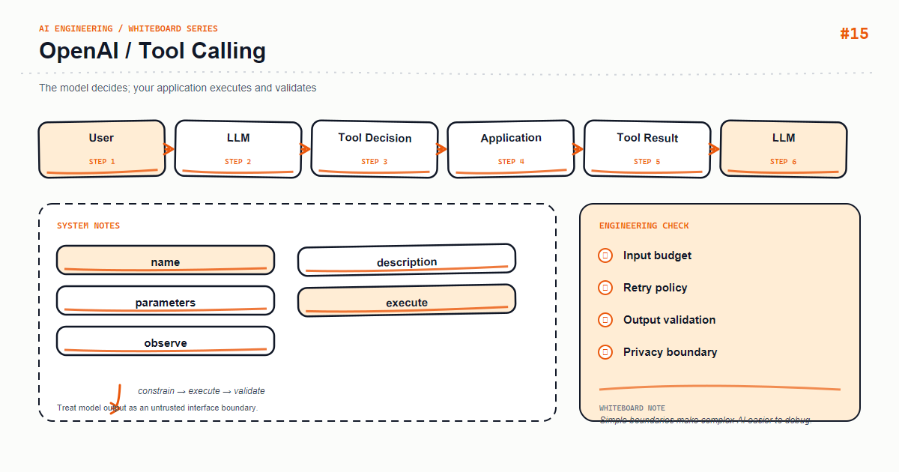

*Whiteboard: OpenAI — OpenAI Tool Calling.*

Tool Calling lets a model emit a function name and arguments; it does not execute the function. The application must check allowlists, arguments, and authorization before returning a tool result.

## Core mental model

The loop is request → tool_call → validate → execute → tool_result → request. Bound every round, and never let a final answer bypass business authorization.

## Key mechanics

A schema describes how to call; a policy decides whether the call is allowed. Read operations may be automatic, while writes need confirmation, idempotency, and audit logs.

## Python example

```python
def execute_tool(call, user):
    if call.name not in TOOL_ALLOWLIST:
        return {"ok": False, "error": "tool_not_allowed"}
    args = validate_args(call.name, call.arguments)
    authorize(user, call.name, args)
    if is_side_effecting(call.name) and not user.confirmed:
        return {"ok": False, "error": "confirmation_required"}
    return TOOL_REGISTRY[call.name](**args)
```

## Course focus

This article turns the whiteboard into explicit engineering boundaries: define inputs and outputs first, then decide how state, failures, and observability work. The examples use Python and focus on durable design principles rather than a particular provider version; verify APIs against the documentation for your installed dependencies.

## Engineering practice

- Keep business rules in the application layer instead of hiding them in untestable prompts or route handlers.
- Add timeouts, bounded retries, and idempotency keys to external calls; retries are not a complete error strategy.
- Record a request id, latency, input version, model/index version, and outcome without logging sensitive raw content.
- Use a small fixed regression set first, then monitor quality and cost with sampled production traffic.

## Common mistakes

- Drawing only the happy path and omitting timeouts, empty results, rate limits, and rollback paths.
- Letting one function parse input, call providers, build prompts, and persist data.
- Replacing typed contracts with string conventions that can only be verified by manual integration.

## Production checklist

- [ ] Inputs, outputs, and error responses have explicit schemas
- [ ] External dependencies have timeouts, bounded retries, rate limits, and fallbacks
- [ ] Logs, metrics, and traces can be correlated to one request
- [ ] Critical paths have unit tests, integration tests, and offline evaluation samples
- [ ] Secrets, user content, and provider responses follow least-privilege and privacy rules

## Practice

Implement the smallest loop shown on the whiteboard. Inject a timeout, an empty result, and a malformed payload, then check whether the system remains stable and diagnosable. Add one metric that proves your optimization improved quality or latency.

## Hands-on exercise

Implement weather lookup and refund request tools. Let weather run automatically, but require confirmation, an idempotency key, and an audit log for refunds.

## Conclusion

An AI feature becomes maintainable when every arrow on the whiteboard maps to an input, an output, and a failure strategy.

