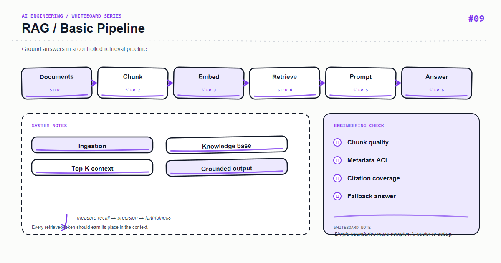

*Whiteboard: RAG — The RAG Basics.*

RAG is not simply pasting a few passages into a prompt. It is a knowledge pipeline whose quality depends on parsing, chunking, recall, prompting, and answer validation.

## Core mental model

The offline path is Load → Clean → Chunk → Embed → Index; the online path is Query → Retrieve → Rerank/Filter → Generate → Cite. Version the boundary between them.

## Key mechanics

Store source, page, section, and a content hash with every chunk. Pass only context above a relevance threshold and require traceable citations.

## Python example

```python
from dataclasses import dataclass

@dataclass
class Chunk:
    text: str
    source: str
    page: int
    chunk_id: str

def make_context(chunks: list[Chunk]) -> str:
    return "\n\n".join(f"[{c.chunk_id}] {c.text} (source={c.source}, page={c.page})" for c in chunks)
```

## Course focus

This article turns the whiteboard into explicit engineering boundaries: define inputs and outputs first, then decide how state, failures, and observability work. The examples use Python and focus on durable design principles rather than a particular provider version; verify APIs against the documentation for your installed dependencies.

## Engineering practice

- Keep business rules in the application layer instead of hiding them in untestable prompts or route handlers.
- Add timeouts, bounded retries, and idempotency keys to external calls; retries are not a complete error strategy.
- Record a request id, latency, input version, model/index version, and outcome without logging sensitive raw content.
- Use a small fixed regression set first, then monitor quality and cost with sampled production traffic.

## Common mistakes

- Drawing only the happy path and omitting timeouts, empty results, rate limits, and rollback paths.
- Letting one function parse input, call providers, build prompts, and persist data.
- Replacing typed contracts with string conventions that can only be verified by manual integration.

## Production checklist

- [ ] Inputs, outputs, and error responses have explicit schemas
- [ ] External dependencies have timeouts, bounded retries, rate limits, and fallbacks
- [ ] Logs, metrics, and traces can be correlated to one request
- [ ] Critical paths have unit tests, integration tests, and offline evaluation samples
- [ ] Secrets, user content, and provider responses follow least-privilege and privacy rules

## Practice

Implement the smallest loop shown on the whiteboard. Inject a timeout, an empty result, and a malformed payload, then check whether the system remains stable and diagnosable. Add one metric that proves your optimization improved quality or latency.

## Hands-on exercise

Create 30 questions with reference answers and sources. Measure retrieval hit rate, citation correctness, and abstention accuracy—not just whether the answer sounds plausible.

## Conclusion

An AI feature becomes maintainable when every arrow on the whiteboard maps to an input, an output, and a failure strategy.

