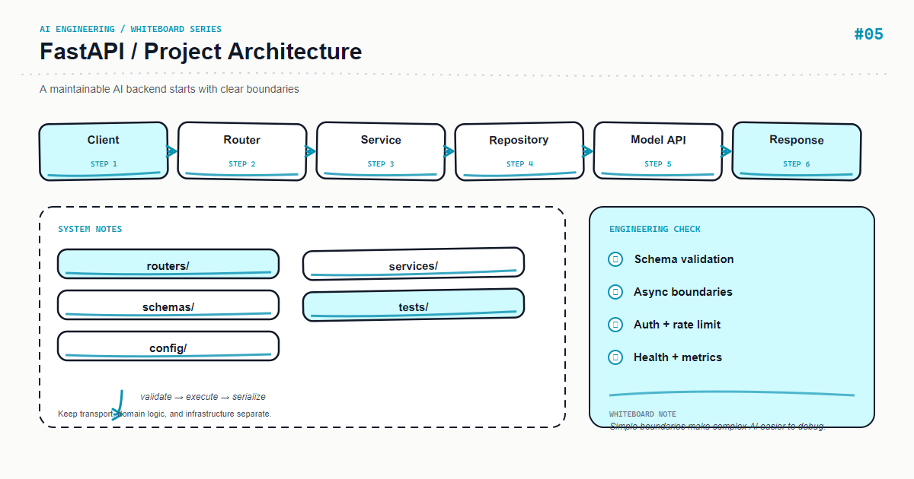

*上图：FastAPI — FastAPI 项目架构。*

FastAPI 很容易在一个文件里快速起步，也很容易因此变成不可维护的全局脚本。更稳妥的结构是让路由处理 HTTP，让 service 处理用例，让 repository 处理数据访问。

## 核心心智模型

推荐的调用方向是 router → service → repository/provider，依赖通过函数参数注入。领域服务不应依赖 Request 或 HTTP 状态码，这样可以在命令行、任务队列和测试中复用。

## 关键机制

配置用环境变量读取并在启动时校验；连接池在 lifespan 中创建和关闭；异常统一映射为稳定的错误 schema。

## Python 示例

```python
from fastapi import APIRouter, Depends
from pydantic import BaseModel

router = APIRouter(prefix="/v1/chat", tags=["chat"])

class ChatRequest(BaseModel):
    message: str

class ChatResponse(BaseModel):
    answer: str

@router.post("", response_model=ChatResponse)
async def chat(req: ChatRequest, service = Depends(get_chat_service)):
    return ChatResponse(answer=await service.answer(req.message))
```

## 课程定位

这篇文章把白板上的模块拆成可以落地的工程边界：先定义输入和输出，再决定状态、失败策略与可观测性。示例使用 Python，重点是设计原则而不是绑定某个供应商版本；上线前请以当前依赖的官方文档为准。

## 工程实践

- 将业务规则放在应用层，不要藏进难以测试的提示词或路由函数。
- 为外部调用设置超时、重试上限和幂等键；重试不是错误处理的全部。
- 记录 request id、耗时、输入版本、模型/索引版本和结果状态，避免记录敏感原文。
- 用小规模固定数据集做回归测试，再用线上抽样监控质量与成本。

## 常见错误

- 只画 happy path，没有画超时、空结果、限流和回滚路径。
- 让一个函数同时负责解析、调用外部服务、拼接提示词和持久化。
- 用字符串约定代替类型契约，导致改动只能靠人工联调。

## 生产检查清单

- [ ] 输入、输出和错误响应均有明确 schema
- [ ] 外部依赖有 timeout、retry、rate limit 和 fallback
- [ ] 日志、指标、trace 能关联到同一次请求
- [ ] 关键路径有单元测试、集成测试和一组离线评测样本
- [ ] 密钥、用户内容和供应商响应按最小权限与隐私策略处理

## 练习建议

先实现白板中的最小闭环，再故意注入一个超时、一个空结果和一个格式错误，观察系统能否给出稳定且可诊断的结果。最后补一条指标，证明你的优化确实改善了质量或延迟。

## 动手练习

把一个包含模型调用的路由拆成 api、services、providers 和 schemas，为 service 注入 fake provider，并用 TestClient 验证错误映射。

## 总结

当白板上的每个箭头都能对应到一个输入、输出和失败策略时，AI 功能才从 demo 变成可维护的系统。

