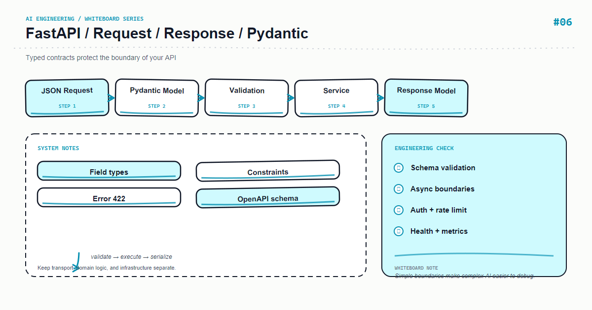

*上图：FastAPI — FastAPI 请求与响应。*

AI 接口的输入经常来自不可信客户端，输出又可能来自不稳定的模型或第三方 API。Pydantic schema 是第一道边界：它把看起来像数据变成可验证的数据。

## 核心心智模型

请求模型负责输入约束，领域模型负责业务不变量，响应模型负责公开字段。不要直接返回 ORM 对象或供应商原始 JSON。

## 关键机制

对字符串设长度上下限，对枚举使用 Literal，对嵌套结构使用模型；对模型输出先解析再返回，解析失败走可观测的 502/422 分支。

## Python 示例

```python
from typing import Literal
from pydantic import BaseModel, Field

class ChatRequest(BaseModel):
    message: str = Field(min_length=1, max_length=4000)
    mode: Literal["answer", "summarize"] = "answer"

class ChatResponse(BaseModel):
    request_id: str
    answer: str
    citations: list[str] = Field(default_factory=list)
```

## 课程定位

这篇文章把白板上的模块拆成可以落地的工程边界：先定义输入和输出，再决定状态、失败策略与可观测性。示例使用 Python，重点是设计原则而不是绑定某个供应商版本；上线前请以当前依赖的官方文档为准。

## 工程实践

- 将业务规则放在应用层，不要藏进难以测试的提示词或路由函数。
- 为外部调用设置超时、重试上限和幂等键；重试不是错误处理的全部。
- 记录 request id、耗时、输入版本、模型/索引版本和结果状态，避免记录敏感原文。
- 用小规模固定数据集做回归测试，再用线上抽样监控质量与成本。

## 常见错误

- 只画 happy path，没有画超时、空结果、限流和回滚路径。
- 让一个函数同时负责解析、调用外部服务、拼接提示词和持久化。
- 用字符串约定代替类型契约，导致改动只能靠人工联调。

## 生产检查清单

- [ ] 输入、输出和错误响应均有明确 schema
- [ ] 外部依赖有 timeout、retry、rate limit 和 fallback
- [ ] 日志、指标、trace 能关联到同一次请求
- [ ] 关键路径有单元测试、集成测试和一组离线评测样本
- [ ] 密钥、用户内容和供应商响应按最小权限与隐私策略处理

## 练习建议

先实现白板中的最小闭环，再故意注入一个超时、一个空结果和一个格式错误，观察系统能否给出稳定且可诊断的结果。最后补一条指标，证明你的优化确实改善了质量或延迟。

## 动手练习

为一个问答接口加入 request_id、长度限制、模式枚举和 citations。分别提交空字符串、超长文本、未知 mode 与缺失字段，确认客户端得到稳定错误。

## 总结

当白板上的每个箭头都能对应到一个输入、输出和失败策略时，AI 功能才从 demo 变成可维护的系统。

