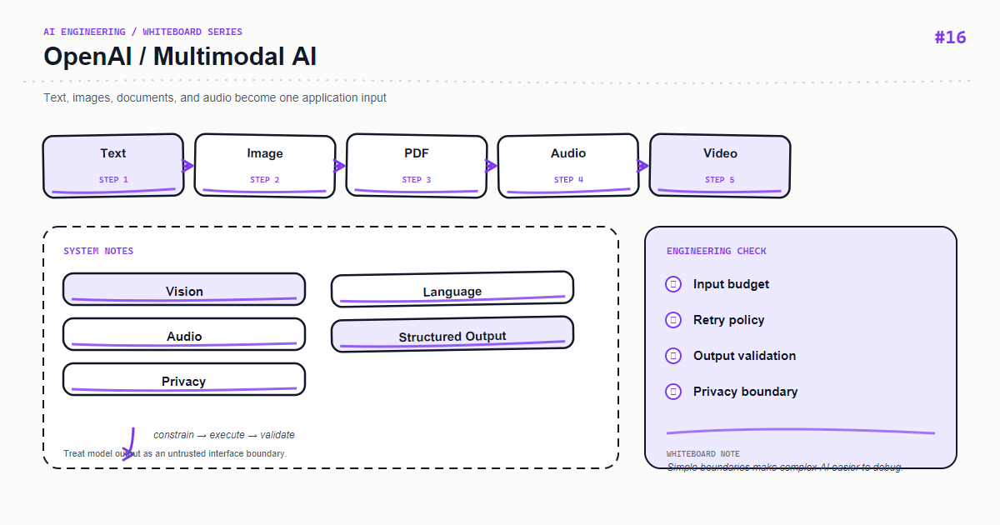

*上图：OpenAI — OpenAI Multimodal AI。*

多模态应用的难点在输入治理，而不是把文件上传给模型。每种媒体都需要类型校验、大小限制、内容安全、权限控制和可追溯的预处理。

## 核心心智模型

Input → Normalize → Multimodal Model → Structured Output → Application。图片可能需要降采样，PDF 可能需要 OCR/版面解析，音频需要转写与时间戳。

## 关键机制

把文件存储和模型请求解耦：先生成短期对象地址并做病毒扫描，再按最小分辨率/页数发送。响应保存 modality、处理版本和证据区域。

## Python 示例

```python
from pydantic import BaseModel, Field

class ImageInsight(BaseModel):
    objects: list[str] = Field(default_factory=list, max_length=20)
    summary: str = Field(max_length=1000)
    confidence: float = Field(ge=0, le=1)

def validate_upload(content_type: str, size: int) -> None:
    if content_type not in {"image/png", "image/jpeg", "application/pdf"}:
        raise ValueError("unsupported_media_type")
    if size > 10 * 1024 * 1024:
        raise ValueError("file_too_large")
```

## 课程定位

这篇文章把白板上的模块拆成可以落地的工程边界：先定义输入和输出，再决定状态、失败策略与可观测性。示例使用 Python，重点是设计原则而不是绑定某个供应商版本；上线前请以当前依赖的官方文档为准。

## 工程实践

- 将业务规则放在应用层，不要藏进难以测试的提示词或路由函数。
- 为外部调用设置超时、重试上限和幂等键；重试不是错误处理的全部。
- 记录 request id、耗时、输入版本、模型/索引版本和结果状态，避免记录敏感原文。
- 用小规模固定数据集做回归测试，再用线上抽样监控质量与成本。

## 常见错误

- 只画 happy path，没有画超时、空结果、限流和回滚路径。
- 让一个函数同时负责解析、调用外部服务、拼接提示词和持久化。
- 用字符串约定代替类型契约，导致改动只能靠人工联调。

## 生产检查清单

- [ ] 输入、输出和错误响应均有明确 schema
- [ ] 外部依赖有 timeout、retry、rate limit 和 fallback
- [ ] 日志、指标、trace 能关联到同一次请求
- [ ] 关键路径有单元测试、集成测试和一组离线评测样本
- [ ] 密钥、用户内容和供应商响应按最小权限与隐私策略处理

## 练习建议

先实现白板中的最小闭环，再故意注入一个超时、一个空结果和一个格式错误，观察系统能否给出稳定且可诊断的结果。最后补一条指标，证明你的优化确实改善了质量或延迟。

## 动手练习

做一个发票图片 → 结构化字段的小实验，分别提交清晰图片、旋转图片、低分辨率图片和超大 PDF，记录字段准确率、处理时延和成本。

## 总结

当白板上的每个箭头都能对应到一个输入、输出和失败策略时，AI 功能才从 demo 变成可维护的系统。

