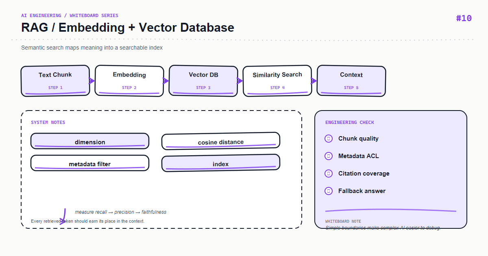

*上图：RAG — RAG Embedding 与向量数据库。*

向量数据库并不会自动理解业务语义；它只负责在给定向量空间里高效找近邻。真正的工程问题是 embedding 版本、距离度量、过滤条件与数据一致性。

## 核心心智模型

文档和 query 必须使用兼容的 embedding 模型与预处理。索引记录应包含 embedding_model、dimensions、corpus_version，便于重建和回滚。

## 关键机制

先做 metadata filter 再做向量搜索，避免把不同租户、语言和权限的数据混在候选集里。

## Python 示例

```python
from uuid import uuid4

record = {
    "id": str(uuid4()),
    "text": "退款申请需要订单号和原因。",
    "vector": embed("退款申请需要订单号和原因。"),
    "metadata": {"tenant_id": "acme", "language": "zh", "embedding_model": "text-embedding-3-small", "corpus_version": "2026-08-21"},
}
# 相似度不是权限判断
```

## 课程定位

这篇文章把白板上的模块拆成可以落地的工程边界：先定义输入和输出，再决定状态、失败策略与可观测性。示例使用 Python，重点是设计原则而不是绑定某个供应商版本；上线前请以当前依赖的官方文档为准。

## 工程实践

- 将业务规则放在应用层，不要藏进难以测试的提示词或路由函数。
- 为外部调用设置超时、重试上限和幂等键；重试不是错误处理的全部。
- 记录 request id、耗时、输入版本、模型/索引版本和结果状态，避免记录敏感原文。
- 用小规模固定数据集做回归测试，再用线上抽样监控质量与成本。

## 常见错误

- 只画 happy path，没有画超时、空结果、限流和回滚路径。
- 让一个函数同时负责解析、调用外部服务、拼接提示词和持久化。
- 用字符串约定代替类型契约，导致改动只能靠人工联调。

## 生产检查清单

- [ ] 输入、输出和错误响应均有明确 schema
- [ ] 外部依赖有 timeout、retry、rate limit 和 fallback
- [ ] 日志、指标、trace 能关联到同一次请求
- [ ] 关键路径有单元测试、集成测试和一组离线评测样本
- [ ] 密钥、用户内容和供应商响应按最小权限与隐私策略处理

## 练习建议

先实现白板中的最小闭环，再故意注入一个超时、一个空结果和一个格式错误，观察系统能否给出稳定且可诊断的结果。最后补一条指标，证明你的优化确实改善了质量或延迟。

## 动手练习

用同一批文档分别建立两个 embedding 版本，记录维度、索引大小、Top-K 重叠率和评测集 Recall@K，再决定是否切换。

## 总结

当白板上的每个箭头都能对应到一个输入、输出和失败策略时，AI 功能才从 demo 变成可维护的系统。

